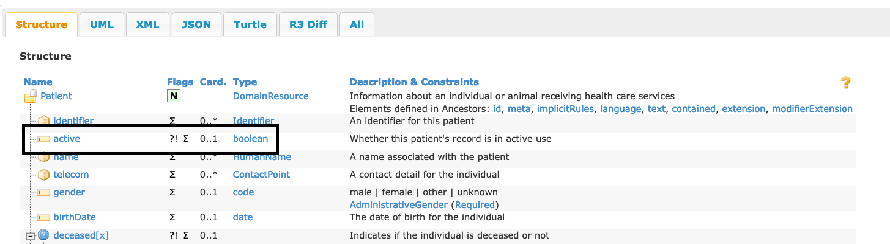

# Processing steps

The transformation process for going from FHIR JSON to FHIR RDF using JSON-LD takes two steps:
1) A structural transformation to the native FHIR JSON structure.
2) The `expansion` of the JSON-LD representation of the FHIR JSON structure using JSON-LD Contexts.

Each of these steps are described below

## Structural preprocessing
### FHIR RDF and Extensions
The current FHIR RDF Implementation Technology Specification (ITS) more closely resembles the FHIR XML ITS than the JSON.
This approach was taken, in no small part, to address the FHIR Extensibility features where (almost) everything from the
FHIR primitive datatypes on up can be extended.

As an example, even the most primitive datatype, [boolean](https://build.fhir.org/datatypes.html#boolean) datatype 
may be extended.  Using the patient resource as an example:



An instance of this would be represented as:
```xml
  ...
<active value="true"/> 
```
In FHIR XML and
```json
    ...
  "active": true,
```
in FHIR JSON.

If we wanted to extend the FHIR boolean with, say, a "certainty" element, we would include the extension _within_
the extended element:

```xml
 <active value="true">
    <extension url="http://examples.org/fhir/extensions/certainty">
      <valueDecimal value="0.65"/> 
    </extension>
 </active>
```

In the JSON representations, _non-object_ extensions use a lexical extension mechanism:
```json
    "active": true,
    "_active": {
        "extension": [
          {
            "url": "http://examples.org/fhir/extensions/certainty",
            "valueDecimal": 0.65
          }
        ]
    },
```

Extensions to non-primitve elements are represented the same way in XML
 (taken from [observation-example-glasgow](https://build.fhir.org/observation-example-glasgow)):
```xml
    <valueCodeableConcept> 
      <coding> 
        <extension url="http://hl7.org/fhir/StructureDefinition/ordinalValue">
          <valueDecimal value="5"/>
        </extension> 
        <system value="http://loinc.org"/> 
        <code value="LA6566-9"/> 
        <display value="Localizing pain"/> 
      </coding> 
      <text value="5 (Localizes painful stimuli)"/> 
    </valueCodeableConcept> 
```
The JSON representation, however, does not use the lexical mechanism, as the extension can be embedded within the 
already existing JSON object:

```json
    "coding": {
        "extension": [
          {
            "url": "http://hl7.org/fhir/StructureDefinition/ordinalValue",
            "valueDecimal": 5
          }
        ],
        "system": "http://loinc.org",
        "code": "LA6566-9",
        "display": "Localizing pain"
     }
```
The _existing_ FHIR RDF ITS chose to stick closely to the XML approach, meaning that, with minor exceptions, _every_
primitive type is represented as a value.  Where one would logically expect to see:
```turtle
@prefix fhir: <http://hl7.org/fhir/> .
     ...
   fhir:Patient.active true;
     ...
```

Which would be the single RDF triple:
```
<http://hl7.org/fhir/Patient/example> <http://hl7.org/fhir/Patient.active> true .
```
One, instead sees:
```turtle
@prefix fhir: <http://hl7.org/fhir/> .

     ...
   fhir:Patient.active [fhir:value true];
     ...
```

Which, instead, produces two triples:
```
<http://hl7.org/fhir/Patient/example> <http://hl7.org/fhir/Patient.active> _:b11732 .
_:b11732 <http://hl7.org/fhir/value> true .
```

### FHIR RDF URIs

### FHIR RDF List Ordering

### FHIR RDF Concept Identifiers

The ability to change the structure of and/or add new data to a JSON structure is outside of the scope of JSON-LD. This
means that, IF we are going to use JSON-LD in the FHIR RDF environment, we have separate the structural changes from
the actual assignment of RDF URI's and literal representation.


