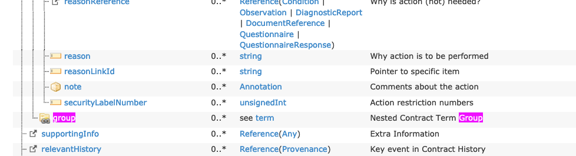
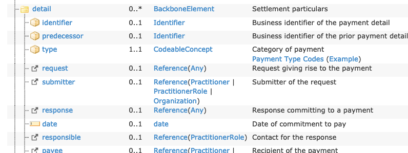

# Summary of FHIR Original (current) JSON-LD Conversions

## Step 1: Structural transformation process
### R4 Transformation
As of 9/29/2020:
* There are 2912 FHIR JSON files in examples-json.zip.  
* All 2912 of these were successfully transformed by the preprocessor.  (Note: this seems suspicious)
* All 2912 were successfully transformed into RDF triples by the JAVA JSON-LD processor
* 2910 of the 2912 files were processed by the RDF comparison routine
   * 2120 Files were skipped:
      * 501 were code systems
      * 776 were value sets
      * 755 were missing ttl to compare with (363 extensions, 200 profiles, 192 other)
      *  88 had more than 5000 triples
   * 312 files failed to match
      *   9 because of UNKNOWN in the output
      * 144 because of contained issues (This is a problem with the _existing_ RDF)
      * 159 for other reasons
   * 478 matched successfully
```text  
     Number of files processed: 2910
      Number of match failures: 312
        Number of content mismatch: 312
      Number of files skipped: 2120
        Number of code systems: 501
        Number of missing FHIR ttl files: 755
          Number of missing extensions: 363
          Number of missing for other reasons: 192
          Number of missing profiles: 200
        Number of file exceeds max triples: 88
        Number of value sets: 776
      Number of successful matches: 478

    ----------------------------------------
    Number of details: 726
      Number of adjusted decimals: 73
      Number of expected files with incorrect contained mapping: 134
      Number of incomplete transforms (UNKNOWN in output): 9
      Number of missing metadata in source: 642
      Number of FHIR.link elements removed from actual: 463
      Number of FHIR.link elements removed from expected: 434
      Number of File has too many triples for detailed compare: 5
      Number of adjusted type arcs: 507
```

### R5 Transformation
There are currently 2881 FHIR JSON files in examples-json.zip. Of these, 2875 were successfully transformed using the
preprocessor.

Files that are not FHIR resources:
* hl7.fhir.r5.corexml.manifest.json
* xver-paths-4.5.json
* hl7.fhir.r5.core.manifest.json
* package-min-ver.json
* uml.json
* hl7.fhir.r5.expansions.manifest.json

Addtiional conversion issues
* testscript-example-multisystem.json - problem: "origin" element 0 already has an index
* testscript-example-multisystem.json - problem: "destination" element 0 already has an index
* testscript-example-multisystem.json - problem: "destination" element 1 already has an index
* parameters-example.json does not have an identifier
* json-edge-cases.json does not have an identifier

## Step 2: Convert the 2875 Preprocessed JSON files into RDF
Of the 2875 source files, 2834 were successfully transformed into RDF format.  The exceptins were due to missing
context definitons for:

* administrableproductdefinition.context.jsonld (1 instance)
* capabilitystatement2.context.jsonld (5 instances)
* citation.context.jsonld (1 instance)
* clinicaluseissue.context.jsonld (1 instance)
* conditiondefinition.context.jsonld (1 instance)
* evidencereport.context.jsonld (1 instance)
* ingredient.context.jsonld (4 instances)
* manufactureditemdefinition.context.jsonld (2 instances)
* medicationusage.context.jsonld (8 instances)
* medicinalproductdefinition.context.jsonld (2 instances)
* nutritionintake.context.jsonld (2 instances)
* packagedproductdefinition.context.jsonld (1 instance)
* permission.context.jsonld (1 instance)
* regulatedauthorization.context.jsonld (2 instances)
* subscriptionstatus.context.jsonld (7 instances)
* subscriptiontopic.context.jsonld (1 issue)
* substancedefinition.context.jsonld (1 issue)

## Step 3: Compare the 2835 converted files to the current FHIR RDF
Of the 2834 input files:
* 289 were identical to the original
* 1320 differed in content to the original
    * 277 contained UNKNOWN uri's (were not completely transformed)
    * 2 had additional or missing subjects
        * orgrole-example-hie
        * orgrole-example-services
    * 212 had mismatched content
* 831 did not have FHIR RDF files to compare to:
    * 251 were FHIR profiles (e.g. `account.profile.ttl`)
    * 181 were questionairres (`...-questionairre.ttl`)
    * 357 were extensions (`/extension-....ttl`)
    * 42 were other (see: Other missing ttl files below)
* 402 were code systems (not currently tested)
* 824 were value sets (not currently tested)

### Analysis
#### Individual issues
binary-example.json has a `resourceType` entry.  This was a bug where "DomainResource" was recognized but not 
"Resource" roots.

### The types of  
####
The key, `reference` is used in multiple contexts.  As an example, the [Consent](http://build.fhir.org/consent.html) resource
has an attribute `reference` whose type is `Reference`.  We have addressed this issue by treating strings as true reference
objects and objects as not.

The key, `index` is used in the [TestScript](http://build.fhir.org/testscript.html) resource.  To address this issue, we
propose changing the plain `index` to `fhir:index` in our transformations.

The claimresponse context, 'claimresponse.adjudication.context.jsonld' is not being generated.  
#### FHIR Profiles
We have a couple of issues with the RDF representation of fhir profiles:
1) The _html_ representation of the profiles is generated (e.g. [account.profile.ttl.html](http://build.fhir.org/account.profile.ttl.html)), but
there is no raw turtle.  The "raw" link just redirects to the html page.
2) Neither the ttl nor the html are included in any of the FHIR zip files.  

* **TODO:** File an issue report with the FHIR community
* **TODO:** Extract at least a representative sample from the profiles and test them to make sure our conversions
are working.


#### UNKNOWN uri's
1) A portion of these were being generated because we have been adding multiple contexts to the 
outermost level -- as an example, specimen.context.jsonld + substance.context.jsonld.  These have overlapping keys,
but with different types, meaning that they are not interpreted correctly.  Part of the solution was adding the
contexts directly _to_ the containing entries (typically `contained`).

   This, however, leads to another issue -- the existing FHIR is not generating RDF for the inner contained elements.  
As an example, 
    ```json
    {
      "resourceType": "Specimen",
      "id": "101",
      "contained": [
        {
          "resourceType": "Substance",
          "id": "hep",
            ...
          }
        }
        ...
    ```
    _should_ generate a number of triples with the hep substance, including:
    
    `<http://hl7.org/fhir/Substance/hep> <http://www.w3.org/1999/02/22-rdf-syntax-ns#type> <http://hl7.org/fhir/Substance> .`
    
    This is not currently the case.  We believe that we are doing this correctly and the current FHIR implementation is wrong.

2) There is an issue with the Medication resource.  The R4 Model shows:

3) General context generation issue:

    

    `group` was not included in the `contract.term.context.jsonld` file -- corrected by manual edit:
    ```json
        "action": {
          "@id": "fhir:Contract.term.action",
          "@context": "contract.term.action.context.jsonld"
        },
        "group": {
          "@id": "fhir:Contract.term.group",
          "@context": "contract.term.context.jsonld"
        },
        "index": {
          "@id": "fhir:index",
          "@type": "http://www.w3.org/2001/XMLSchema#integer"
        }
    ```
   TODO: Need a ticket to fix this

4) Bundle ResourceType missing:
    Not sure why this is, but `resourceType` is not being emitted in `bundle.context.jsonld`:
    ```
    "rdf": "http://www.w3.org/1999/02/22-rdf-syntax-ns#",
    "id": {
      "@id": "fhir:Resource.id",
      "@context": "string.context.jsonld"
    },
    "resourceType": {
      "@id": "rdf:type",
      "@type": "@id"
    },
    "meta": {
      "@id": "fhir:Resource.meta",
      "@context": "meta.context.jsonld"
    },
   ```
   Manually added this. TODO: Need a ticket to fix this
   
5) Reference link issue

    See: r4 paymentreconciliation-example for details.  
    
    
    The general problem is the following structure:
    ```json
    "detail": [
       ...
      "request": {
        "reference": "http://www.BenefitsInc.com/fhir/oralhealthclaim/225476332699"
      },
    ```
    Needs to produce the following output:
    ```turtle
     fhir:PaymentReconciliation.detail.request 
       [ fhir:Reference.reference 
           [ ns1:value "http://www.BenefitsInc.com/fhir/oralhealthclaim/225476332699" ] ;
             ns1:link <http://www.BenefitsInc.com/fhir/oralhealthclaim/225476332699> 
       ] ;
    ```

    The fundamental problem is, as JSON-LD can't add tags, we need to _recognize that the range of `request` is `Reference`_
    in order to add the additional element below in the preprocessing step:
    
    ```json
        "detail": [
           ...
         "request": {
            "reference": {
               "value": "http://www.BenefitsInc.com/fhir/oralhealthclaim/225476332699"
            },
           fhir:link {
             "@id": "<http://www.BenefitsInc.com/fhir/oralhealthclaim/225476332699>"
           }
         },
    ```
    
### Missing links (no pun intended)
The FHIR [canonical](http://hl7.org/fhir/datatypes.html#canonical) data type presents a different sort of problem.  While
we are making some assumptions about the uniqueness of tags, we can map `id` and `reference` to their appropriate targets.
`canonical`, however, provides no way to determine that someting is of this type without having access to the underlying
definitions.  As an example, [ActivityDefinition](http://hl7.org/fhir/activitydefinition.html), and its example, 
[administer-zika-virus-exposure-assessment](http://hl7.org/fhir/administer-zika-virus-exposure-assessment.html) has 
```json
  "library": [
    "Library/zika-virus-intervention-logic"
  ],
```

We have to, somehow, recognize that `libarary` is of type `canonical` so that we can add the `fhir:link` tag.  What we
have at the moment is:
```json
   "library": [
      {
         "value": "Library/zika-virus-intervention-logic",
         "index": 0
      }
   ],
```
and we need to add a link:
```json
   "library": [
      {
         "value": "Library/zika-virus-intervention-logic",
         "index": 0
         "fhir:link": {
            "@id": "Library/zika-virus-intervention-logic"
         }
      }
   ],
```
Also, while the current FHIR RDF does not add a type arc, there are two possible ways that this might (should?) occur:

1) the definition of `library` is `canonical(Library)`, meaning that we KNOW what the type is no matter the URL 
2) the URL could be parsed just like in other places, which will also yield a type.
    
## Other missing ttl files
* examples-ttl/capabilitystatement2.profile.ttl
* examples-ttl/cm-address-type-v3.ttl
* examples-ttl/cm-address-use-v2.ttl
* examples-ttl/cm-address-use-v3.ttl
* examples-ttl/cm-administrative-gender-v2.ttl
* examples-ttl/cm-administrative-gender-v3.ttl
* examples-ttl/cm-composition-status-v3.ttl
* examples-ttl/cm-contact-point-system-v2.ttl
* examples-ttl/cm-contact-point-use-v2.ttl
* examples-ttl/cm-contact-point-use-v3.ttl
* examples-ttl/cm-data-absent-reason-v3.ttl
* examples-ttl/cm-detectedissue-severity-v3.ttl
* examples-ttl/cm-document-reference-status-v3.ttl
* examples-ttl/cm-name-use-v2.ttl
* examples-ttl/cm-name-use-v3.ttl
* examples-ttl/conceptmaps.ttl
* examples-ttl/cqf-questionnaire.profile.ttl
* examples-ttl/dataelements.ttl
* examples-ttl/definition.ttl
* examples-ttl/device-extensions-Device-din.ttl
* examples-ttl/elementdefinition-de.profile.ttl
* examples-ttl/event.ttl
* examples-ttl/external-resources.ttl
* examples-ttl/familymemberhistory-genetic.profile.ttl
* examples-ttl/fivews.ttl
* examples-ttl/integer64.profile.ttl
* examples-ttl/json-edge-cases.ttl
* examples-ttl/participant.ttl
* examples-ttl/participantcontactable.ttl
* examples-ttl/participantliving.ttl
* examples-ttl/patient-extensions-Patient-age.ttl
* examples-ttl/patient-extensions-Patient-birthOrderBoolean.ttl
* examples-ttl/patient-extensions-Patient-mothersMaidenName.ttl
* examples-ttl/product.ttl
* examples-ttl/profiles-others.ttl
* examples-ttl/profiles-resources.ttl
* examples-ttl/profiles-types.ttl
* examples-ttl/provenance-relevant-history.profile.ttl
* examples-ttl/questionnaireresponse-extensions-QuestionnaireResponse-item-subject.ttl
* examples-ttl/request.ttl
* examples-ttl/search-parameters.ttl
* examples-ttl/valuesets.ttl
    
    
 
